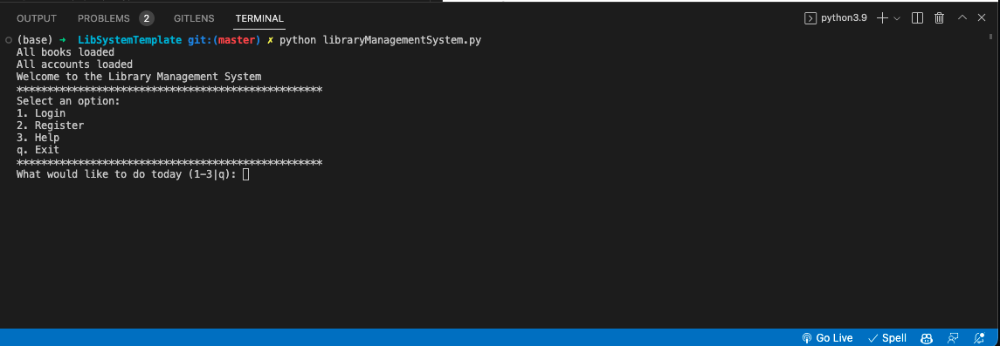
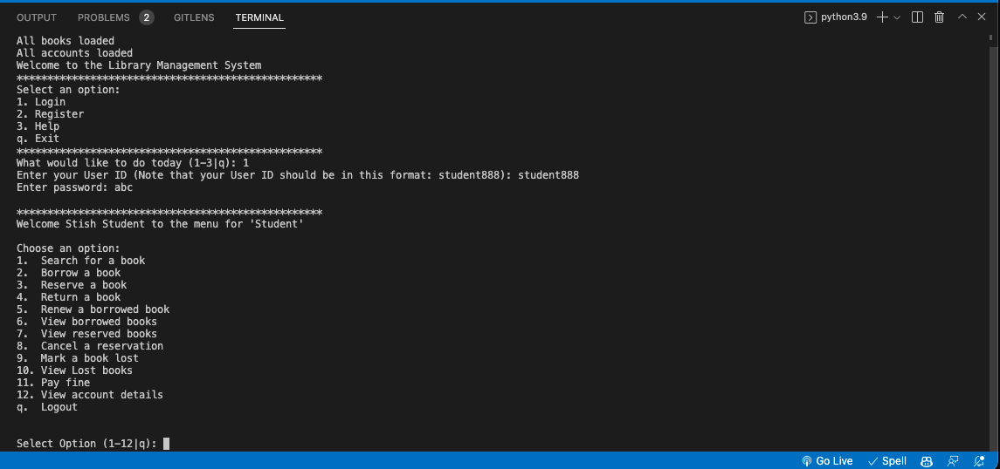

# Library Management System

## Introduction

This is a library management system. It is a Cli application. It is written in python. It uses sqlite3 as database.

## Requirements

- Python 3.6 or above
- Sqlite3

## How to use

```bash
python libraryManagementSystem.py
```

## Features

Student can:

- Search for books
- Borrow books
- Reserve books
- Return books
- Renew a borrowed book
- View borrowed books
- View reserved books
- Cancel a reservation
- Mark a book as lost
- View lost books
- Pay for lost books
- View Account details
- logout

Staff can:

- Search for books
- Borrow books
- Reserve books
- Return books
- Renew a borrowed book
- View borrowed books
- View reserved books
- Cancel a reservation
- Mark a book as lost
- View lost books
- Pay for lost books
- View Account details
- logout

Librarian can:

- Add books
- Delete books
- Update books
- Search for books
- View all books
- View all students
- View all borrowed books
- View all reserved books
- View all lost books
- logout


## Screenshots

- Welcome Screen


- Login Screen
